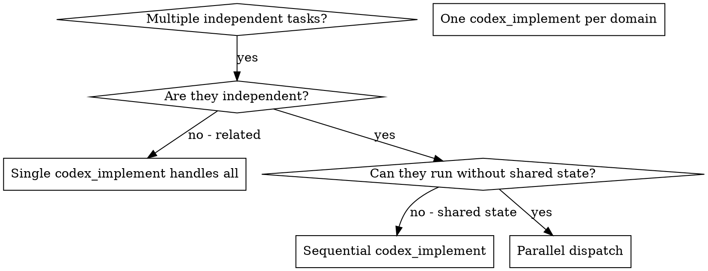

<!--
Upstream source: obra/superpowers skills/dispatching-parallel-agents/SKILL.md
Last synced: 2026-04-05
Divergence: Codex-backed dispatch — parallel `codex_implement` MCP calls replace upstream `Task()` tool calls; review still done by Claude after all threads return
-->

# Dispatching Parallel Agents

## Overview

When you have multiple unrelated tasks (different subsystems, different bugs), working them sequentially wastes time. Each thread is independent and can happen in parallel.

**Core principle:** Dispatch one `codex_implement` per independent problem domain. Let them work concurrently.

## When to Use



**Use when:**
- 3+ failing test files with different root causes
- Multiple subsystems broken independently
- Each problem can be understood without context from others
- No shared state between threads (no same-file edits)

**Don't use when:**
- Failures are related (fix one might fix others)
- Need to understand full system state first
- Threads would edit the same files

## The Pattern

### 1. Identify Independent Domains

Group tasks by what's being changed:
- Thread A: Agent forwarding contract in `scripts/`
- Thread B: Test fixture updates in `tests/fixtures/`
- Thread C: Schema validation in `schemas/`

Each domain is independent — Thread A doesn't touch Thread B's files.

### 2. Create Focused Task Prompts

Each `codex_implement` call gets:
- **Specific scope:** One file or subsystem
- **Clear goal:** What done looks like
- **Constraints:** Don't change other code
- **Expected output:** Summary of what was found and fixed

### 3. Dispatch in Parallel

Call multiple `codex_implement` tools in a single message so they run concurrently:

```json
{
  "tool": "codex_implement",
  "arguments": {
    "taskId": "parallel-A",
    "prompt": "Fix the 3 failing tests in tests/adapter/codex-run.test.mjs. These are timeout-related. Root cause and fix only — do not touch other test files.",
    "workspaceRoot": "/absolute/path/to/your/repo"
  }
}
```

```json
{
  "tool": "codex_implement",
  "arguments": {
    "taskId": "parallel-B",
    "prompt": "Fix the schema mismatch in schemas/implementer-result.schema.json. The 'tests' field is missing from the required array. Do not touch other schemas.",
    "workspaceRoot": "/absolute/path/to/your/repo"
  }
}
```

```json
{
  "tool": "codex_implement",
  "arguments": {
    "taskId": "parallel-C",
    "prompt": "Update the fixture in tests/fixtures/sample-result.jsonl to match the new implementer-result schema. Only touch that fixture file.",
    "workspaceRoot": "/absolute/path/to/your/repo"
  }
}
```

### 4. Review and Integrate

When all threads return:
- Read each summary
- Verify fixes don't conflict (check for same-file edits)
- Run full test suite
- Use `codex_resume` if any thread needs follow-up

## Writing Good Prompts

Good prompts are:
1. **Focused** - One clear problem domain
2. **Self-contained** - All context needed to understand the problem
3. **Specific about constraints** - Name files they must NOT touch
4. **Clear about output** - Summary of root cause and changes made

**Bad:**
```
"Fix all the tests"  ← agent gets lost
"Fix the race condition"  ← agent doesn't know where
```

**Good:**
```
"Fix the 3 failing tests in tests/adapter/codex-run.test.mjs.
Tests: [list test names + error messages].
Root cause is likely X. Fix by Y.
Do NOT change production code.
Return: root cause found and what you changed."
```

## Common Mistakes

**Too broad:** Agent gets lost in unrelated code.
**No constraints:** Agent refactors everything.
**Vague output:** You don't know what changed.
**Overlapping scope:** Threads edit same files, creating conflicts.

## When NOT to Use

**Related failures:** Investigate together, fixing one might fix others.
**Need full context:** Understanding requires seeing the whole system.
**Exploratory debugging:** You don't know what's broken yet — use `codex_debug` first.
**Shared state:** Threads would interfere (editing same files).

## After All Threads Return

1. **Review each summary** — understand what changed
2. **Check for conflicts** — did any threads edit the same file?
3. **Run full suite** — `npm test`
4. **Resume if needed** — use `codex_resume` with the appropriate `taskId` and `sessionId`
5. **Spot check** — Codex can make systematic errors; read the diff

## Key Benefits

1. **Parallelization** — multiple threads work simultaneously
2. **Focus** — each thread has narrow scope
3. **Independence** — threads don't interfere
4. **Speed** — N problems solved in time of 1
